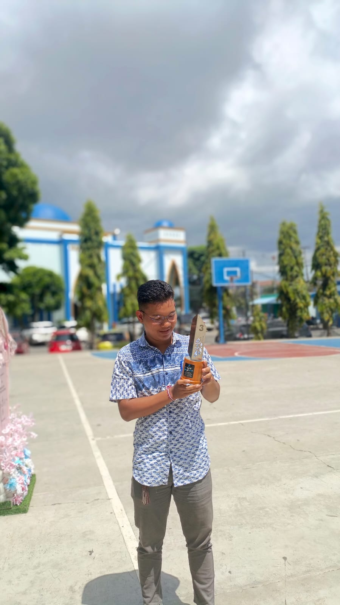

<!DOCTYPE html>
<html lang="id">
<head>
<meta charset="UTF-8">
<meta name="viewport" content="width=device-width, initial-scale=1.0">
<title>Portfolio - I Gde Arkana Satwikaa</title>
<link href="https://fonts.googleapis.com/css2?family=Poppins:wght@300;400;600;700&display=swap" rel="stylesheet">

</head>

<body>

<!-- NAVBAR -->
<nav class="navbar">
 

  <a class="nav-logo" href="#">AwanLangit</a>
  <ul class="nav-menu">
   <li><a href="#home" class="nav-link">Home</a></li>
   <li><a href="#about" class="nav-link">About</a></li>
   <li><a href="#skills" class="nav-link">Skills</a></li>
   <li><a href="#projects" class="nav-link">Projects</a></li>
   <li><a href="#certificates" class="nav-link">Certificates</a></li>
   <li><a href="#contact" class="nav-link">Contact</a></li>
  </ul>
 

</nav>

<!-- HERO -->
<section class="hero" id="home">
 

  <h1>I Gde Arkana Satwikaa</h1>
  
Cybersecurity & IoT Developer

 

</section>

<!-- ABOUT -->
<section id="about">
 

  <h2 class="section-title">Tentang Saya</h2>
  

   
   

    
Mahasiswa Cybersecurity & IoT dengan pengalaman kompetisi internasional di China. 
       Fokus pada keamanan sistem, pengembangan IoT, dan pengujian penetrasi.

   

  

 

</section>

<!-- SKILLS -->
<section id="skills">
 

  <h2 class="section-title">Skills</h2>
  

   
Cybersecurity
    

   

   
IoT Development
    

   

   
Programming
    

   

  

 

</section>

<!-- PROJECTS -->
<section id="projects">
 

  <h2 class="section-title">Projects & Achievements</h2>
  

   

    <h3>Cybersecurity Competition - China</h3>
    
Finalist kompetisi keamanan siber internasional.

    International
   

   

    <h3>IoT Innovation Contest - China</h3>
    
Pengembangan sistem IoT untuk smart monitoring.

    International
   

   

    <h3>Debate Champion - Province</h3>
    
Juara debat tingkat provinsi.

    Achievement
   

  

 

</section>

<!-- ===== CERTIFICATE SECTION ===== -->
<section id="certificates">
  <h2 data-aos="fade-up">Certificates & Training</h2>
  

    Berikut adalah pelatihan dan sertifikasi yang telah saya selesaikan.
  

  

    <!-- Certificate Card -->
    

      

        <h3>Introduction to Cyber Security and Career Awareness</h3>
        
<strong>Program:</strong> Micro Skill – Digital Talent Scholarship 2025

        
<strong>Penyelenggara:</strong> Pusat Pengembangan Literasi Digital (Komdigi)

        
<strong>Durasi:</strong> 1 Jam Pelatihan

        
<strong>Tanggal:</strong> 7 November 2025

        
<strong>Nomor Sertifikat:</strong> 
           2299734850-22383/MS/BLSDM.Komdigi/2025
        

        <a href="sertifikat-cybersecurity.pdf" class="btn-view" target="_blank">
          Lihat Sertifikat PDF
        </a>
      

    

  

</section>

<!-- CONTACT -->
<section id="contact">
 

  <h2 class="section-title">Contact</h2>
  

   

    
📧 kanzzarkana@gmail.com

    
📱 +62 85136117399

    
📍 Bandar Lampung

   

   

    <form onsubmit="sendMessage(event)">
     <input type="text" placeholder="Nama" required style="width:100%;padding:10px;border-radius:8px;border:none;margin-bottom:10px;">
     <input type="email" placeholder="Email" required style="width:100%;padding:10px;border-radius:8px;border:none;margin-bottom:10px;">
     <textarea placeholder="Pesan" required style="width:100%;padding:10px;border-radius:8px;border:none;margin-bottom:10px;"></textarea>
     <button style="padding:8px 20px;border:none;border-radius:20px;background:var(--primary);color:white;cursor:pointer;">Kirim</button>
    </form>
   

  

 

</section>

<footer>
 © 2026 I Gde Arkana Satwikaa — Premium Portfolio
</footer>

<!-- ==== Scroll Reveal Script ==== -->

</body>
</html>
